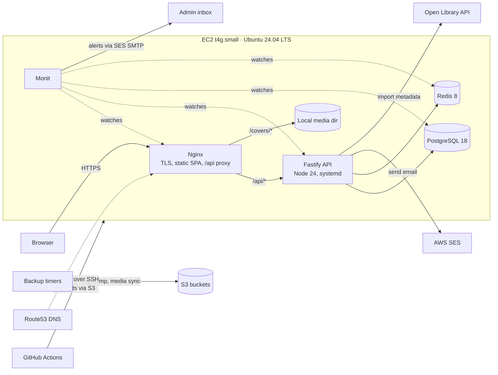

# 02 — Architecture

_Last updated: 2026-07-12 · Status: Accepted_

## System context

One EC2 host runs everything behind Nginx; AWS managed services handle DNS, email, and object storage. No containers in production ([ADR-0006](adr/0006-systemd-ansible-over-docker.md)).



Key consequences of the single-origin design:
- The SPA and the API share one domain (`bestbooks.guide` serves the SPA; `/api/v1/*` proxies to Fastify). **No CORS**, simpler cookies, one TLS cert.
- Book covers are stored on local disk at import time and served by Nginx with long cache headers; S3 holds a nightly-synced replica plus DB backups (see [06 — Infrastructure](06-infrastructure.md)).

## Repository layout (npm workspaces monorepo)

Single GitHub repo, npm workspaces ([ADR-0002](adr/0002-single-repo-npm-workspaces.md)):

```
best-books-guide/
├── apps/
│   ├── web/                 # React 19 + Vite 7 + Tailwind 4 SPA
│   └── api/                 # Fastify 5 + Drizzle (see layering below)
├── packages/
│   └── shared/              # API contract types, shared constants, slug helpers
├── infra/
│   ├── terraform/
│   │   ├── bootstrap/       # state bucket + GitHub OIDC role (applied once, locally)
│   │   ├── envs/prod/       # root module for production
│   │   └── modules/         # network, compute, dns, email, storage
│   └── ansible/
│       ├── inventories/prod/
│       ├── roles/           # common, hardening, nodejs, postgresql, redis, nginx, monit, app
│       └── playbooks/       # site.yml (converge host), deploy.yml (app release)
├── docs/                    # this suite + adr/
├── .github/workflows/       # ci.yml, deploy.yml, terraform.yml, codeql.yml
├── CLAUDE.md  TODO.md  README.md  LICENSE
```

## Backend: pragmatic clean architecture

Goal: the domain logic doesn't know about Fastify, Drizzle, Redis, or SES — so any of them can be swapped (or the app split) without touching business rules. We keep it to **three layers plus adapters**; no ceremony beyond that.

```
apps/api/src/
├── domain/          # Entities & domain types. Zero imports from other layers.
├── app/             # Use-cases (services) + ports (interfaces the use-cases need)
│   ├── ports/       #   e.g. BookRepository, EmailSender, TokenStore, Clock
│   └── usecases/    #   e.g. ImportBookFromOpenLibrary, SubmitReview, RotateRefreshToken
├── infra/           # Adapters implementing ports
│   ├── db/          #   Drizzle schema + repositories (PostgreSQL)
│   ├── redis/       #   token store, rate-limit store, cache
│   ├── email/       #   SES sender (SDK v3, instance role — no static keys)
│   └── openlibrary/ #   OL client (fetch, timeout, retry, rate-limited)
├── http/            # Fastify server: routes, TypeBox schemas, auth plugin, error mapper
└── main.ts          # Composition root: builds adapters, injects into use-cases, starts server
```

**The dependency rule:** `http` and `infra` may import from `app` and `domain`; `app` imports only `domain`; `domain` imports nothing. Dependency injection is constructor-based, wired by hand in `main.ts` — no DI framework.

Request lifecycle example — `PUT /api/v1/me/shelf/:bookId`:
1. Fastify route validates body against a TypeBox schema (400/422 on failure, free from the schema).
2. Auth plugin verifies the access JWT, loads `userId` into request context.
3. Route calls `SetReadingStatus.execute({userId, bookId, status, startedAt})`.
4. Use-case enforces rules (book exists, valid transition), calls `ReadingStatusRepository.upsert(...)`.
5. Drizzle adapter runs the SQL; route maps the result to the response schema.

Errors: use-cases throw typed domain errors (`NotFound`, `Conflict`, `Forbidden`, `ValidationFailed`); a single Fastify error handler maps them to RFC 9457 problem responses ([04 — API](04-api.md)).

## Frontend: SEO-ready SPA

SPA first, deliberately built so SSR can be added without rework ([ADR-0008](adr/0008-spa-first-ssr-ready.md)).

- **React 19 + Vite 7 + Tailwind CSS 4** (via `@tailwindcss/vite` — no PostCSS config needed).
- **React Router 7** in data/library mode. Its framework mode is the later SSR upgrade path, so route structure follows RR conventions now.
- **TanStack Query 5** for all server state (caching, revalidation, optimistic shelf/rating updates). Components never `fetch` directly; a thin typed API client in `packages/shared` mirrors the REST contract.
- **React 19 native document metadata**: `<title>`/`<meta>` rendered in route components (hoisted by React) — per-page titles, descriptions, OpenGraph tags without a helmet library.
- **Forms**: react-hook-form for auth/admin forms.
- **Client state**: TanStack Query covers nearly everything; anything left (e.g. toasts) uses React context — add Zustand only if pain appears.
- **Calm and fast by principle** ([01 — Product](01-product.md) §Principles): no third-party scripts, ads, analytics, or trackers — the CSP's `script-src 'self'` ([05 — Security](05-security.md)) makes the promise structural, not aspirational. Small bundle, book content over widgets.

```
apps/web/src/
├── routes/        # RR7 route tree mirroring public URLs (subjects, lists, books, me, admin)
├── features/      # feature folders: catalog/, shelf/, reviews/, auth/, admin/
├── components/    # shared UI (Tailwind; add shadcn/ui pieces as needed)
├── lib/           # api client, query client, auth token holder
```

SEO readiness in the SPA (cheap now, pays off later):
- Stable slug URLs identical to what SSR would use; canonical tags.
- `sitemap.xml` and `robots.txt` generated **server-side** by the API from published content, proxied by Nginx.
- JSON-LD (`schema.org/Book`, `ItemList`) rendered on book/list pages.
- Upgrade path when SEO matters: switch RR7 to framework mode with SSR on the same host (Node process behind Nginx) — data loading already goes through the REST API, components are unchanged.

## Tech stack & versions (researched July 2026)

| Layer | Choice | Version | Why |
|---|---|---|---|
| Language | TypeScript everywhere | 5.x latest, `strict` | Shared contract types client↔server; the 2026 professional default |
| Runtime | Node.js | **24 LTS** | Active LTS now; plan the Node 26 jump when it hits LTS (Oct 2026) — [TODO](../TODO.md) |
| API framework | Fastify | 5.x | Built-in JSON-Schema validation, first-class TS, Pino logging, async-safe error handling — the greenfield pick over Express 5 ([ADR-0003](adr/0003-fastify-over-express.md)) |
| Validation | TypeBox (`@sinclair/typebox`) | latest | One schema = runtime validation + static types + OpenAPI, native to Fastify |
| ORM / migrations | Drizzle ORM + drizzle-kit | latest | SQL-first (you actually practice PostgreSQL), migrations are reviewable SQL files, types inferred from code ([ADR-0004](adr/0004-drizzle-over-prisma.md)) |
| Database | PostgreSQL | **18** | Current major (Sep 2025); native `uuidv7()` for PKs; supported to 2030 |
| Cache/sessions | Redis | **8.x** | Sessions/refresh-tokens, rate limiting, hot-page cache; AGPLv3 licence option is fine for self-hosting ([ADR-0007](adr/0007-self-managed-data-stores.md)) |
| Frontend | React + Vite + Tailwind | 19 / 7 / 4 | Current stable line; Tailwind 4's Vite plugin, zero-config |
| Routing / data | React Router 7 + TanStack Query 5 | latest | Mainstream 2026 pair; RR7 gives the SSR upgrade path |
| Auth | `@fastify/jwt` + rotating opaque refresh tokens in Redis | — | 2026 gold standard for SPAs; details in [05 — Security](05-security.md) ([ADR-0005](adr/0005-jwt-refresh-rotation.md)) |
| Passwords | Argon2id (`argon2`) | OWASP params | Current OWASP recommendation over bcrypt |
| Testing | Vitest + Testing Library; Fastify `.inject()`; Playwright (from M4) | latest | One test runner across the monorepo; gates & budgets in §Testing strategy |
| Lint/format | ESLint 9 (flat config) + Prettier | latest | Mainstream; Biome noted as a future consolidation option |
| Package manager | npm workspaces | 11 (bundled with Node 24) | Practising canonical npm is a project goal ([ADR-0002](adr/0002-single-repo-npm-workspaces.md)); zero extra toolchain |
| Host OS | Ubuntu 24.04 LTS | — | Battle-tested; revisit 26.04 LTS (Apr 2026, supported to 2031) once `.1` lands — [TODO](../TODO.md) |
| Infra | Terraform ≥1.12 + AWS provider 6.x, Ansible core ≥2.19, Monit | — | See [06](06-infrastructure.md)/[07](07-operations.md); S3-native state locking (no DynamoDB) |

## Cross-cutting concerns

- **Configuration**: 12-factor env vars, validated at boot with a TypeBox schema (fail fast, typo-proof). `.env` rendered by Ansible from Vault-encrypted values; `.env.example` kept current in-repo.
- **Logging**: Pino JSON to stdout → journald (queryable, rotated by systemd). Request IDs on every log line; no PII in logs.
- **Caching strategy**: Redis caches rendered public payloads (book page, list page) with short TTL (60s) + explicit invalidation on admin writes. Defer it until pages actually feel slow — correctness first.
- **Background work**: none in MVP beyond systemd timers (backups, cert renew). If job queues become necessary (e.g. bulk imports), BullMQ on the existing Redis — not before.
- **Health**: `GET /healthz` (liveness + DB/Redis ping) used by Monit, deploy gates, and uptime checks.

## Testing strategy

Full-stack coverage with a fast-feedback pyramid. The gates are non-negotiable in CI, and **CI speed is a feature**: if tests are slow, they stop being run.

| Layer | Tool | What it proves |
|---|---|---|
| Unit — domain & use-cases | Vitest with in-memory fakes of the ports | Business rules, no I/O — the clean-architecture payoff |
| Unit — web components/hooks | Vitest + Testing Library (happy-dom) | Rendering logic, forms, optimistic updates |
| Integration — API | Vitest; Fastify `.inject()`; **real PG + Redis** (service containers), migrations applied first | Repository SQL, auth flows (rotation, reuse detection), route schemas — and every CI run doubles as a migration test |
| E2E — journeys | Playwright against the compose stack | register→verify→login · browse→track→shelve→rate→review · admin import→curate→publish |
| Infra | ansible-lint; terraform fmt/validate/tflint + PR plan; post-deploy `/healthz` gate | Config sanity; the deploy pipeline is the final integration test |

**Coverage gates** (Vitest V8 provider, enforced in CI):
- `domain/` + `app/` + `packages/shared`: **≥ 90% lines and branches** — this is where bugs are expensive and tests are cheap.
- Repo-wide: **≥ 80%**, plus a **ratchet**: a PR may never lower recorded coverage. Adapters and routes earn their coverage through integration tests, UI through component tests; we gate hard numbers where they're honest rather than worship 100%-line coverage, which breeds assertion-free tests.

**Speed budget**: unit + integration **< 2 min** (so `npm test` stays a reflex); whole PR pipeline **< 7 min** wall-clock. Tactics: cached `npm ci`, parallel CI jobs (lint+typecheck / test / build+e2e), one shared PG instance for integration tests (a dedicated `bestbooks_test` database, migrated once in Vitest `globalSetup`, then `TRUNCATE … RESTART IDENTITY CASCADE` + Redis `FLUSHDB` between tests with `fileParallelism` off — simpler than per-suite schemas, since Drizzle migrations and `CREATE EXTENSION` are database-scoped; revisit if the budget breaks), Playwright on PRs limited to a ≤3-journey smoke (full suite on `main` + nightly). If the budget breaks, fixing it is a `ci`-typed task, not an aspiration.

## What we deliberately did NOT include

Microservices, GraphQL, Kubernetes, CloudFront, Elasticsearch, RDS/ElastiCache, a BFF layer, Docker-in-production. Each is either unnecessary at this scale or has a documented adoption path in [06 — Infrastructure](06-infrastructure.md) §Scaling. The architecture's job is to make adding them later cheap, not to add them now.

A second exclusion class is **principled, not scale-based** ([01 — Product](01-product.md) §Principles): ads, analytics/tracking, and behaviour-profile recommendation engines — no seams kept warm for these. Note what this does *not* exclude: the in-catalogue related-books strip is SQL over the curation graph (same author, co-listed), not an engine; and opt-in notifications/digests may arrive later as a deliberate, quiet addition — nothing pre-built for them now.
