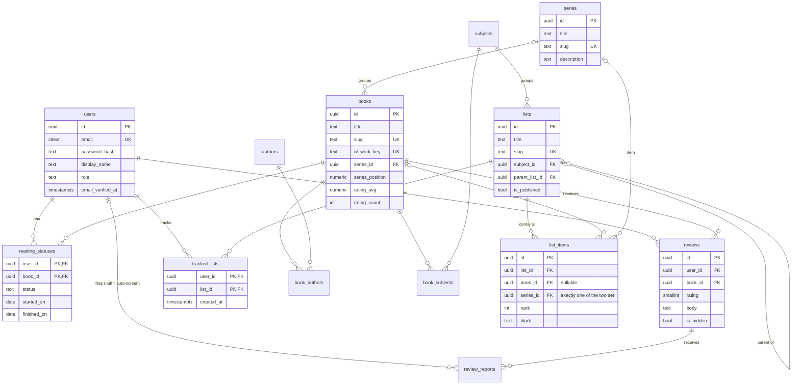

# 03 — Data model

_Last updated: 2026-07-12 · Status: Accepted_

PostgreSQL 18. Conventions: `uuid` PKs via native `uuidv7()` (time-ordered → index-friendly), `timestamptz` for all timestamps, `citext` for email, snake_case names, FKs `ON DELETE` rules stated explicitly, soft-delete only where the product needs it (reviews).

## ERD

## Tables

### users
| column | type | notes |
|---|---|---|
| id | uuid PK | `default uuidv7()` |
| email | citext | `UNIQUE NOT NULL` |
| password_hash | text | Argon2id (encodes its own params) |
| display_name | text | 1–50 chars, not unique |
| role | text | `CHECK (role IN ('member','admin'))`, default `member` |
| email_verified_at | timestamptz | null until verified; rating/reviewing requires non-null |
| created_at / updated_at | timestamptz | app-maintained `updated_at` via Drizzle `$onUpdate` |

Deleting a user (post-MVP feature, designed now): `reading_statuses`, `reviews`, `review_reports` cascade; reviews vanish rather than orphan.

### books
| column | type | notes |
|---|---|---|
| id | uuid PK | |
| title, subtitle | text | subtitle nullable |
| slug | text | `UNIQUE NOT NULL`, generated from title (+ year on collision), immutable after publish |
| description | text | editor-editable, may diverge from OL |
| isbn13 | text | nullable, `UNIQUE` where not null |
| ol_work_key | text | e.g. `OL45804W`, nullable (manual entries), `UNIQUE` where not null — the dedupe key for imports |
| cover_path | text | relative path under the media dir, nullable |
| first_published_year | int | nullable |
| page_count | int | nullable |
| language | text | BCP-47-ish, default `en` |
| series_id | uuid | nullable FK → series, `ON DELETE SET NULL` — a book belongs to at most one series |
| series_position | numeric(4,1) | nullable; order within the series (decimal allows novellas: 2.5) |
| rating_avg | numeric(3,2) | denormalised aggregate, default 0 |
| rating_count | int | default 0 |
| created_at / updated_at | timestamptz | |

**Aggregate maintenance:** `rating_avg`/`rating_count` are updated in the same transaction as any review insert/update/delete/hide (single `UPDATE ... FROM` recompute for that book). At this scale a live recompute per write is cheap and can't drift. No triggers — logic stays visible in the repository layer.

### authors / book_authors
`authors(id, name, slug UNIQUE, ol_author_key UNIQUE nullable)`; `book_authors(book_id FK CASCADE, author_id FK CASCADE, position int)` — composite PK `(book_id, author_id)`; `position` preserves credit order.

### series
`series(id, title, slug UNIQUE, description, created_at, updated_at)`. Created and ordered **manually by admins** — Open Library's series data is too patchy to import. A series is a curation device ([01 — Product](01-product.md) F1): it can occupy a list slot and has its own page, but member actions (shelve/rate/review) stay book-level, so no aggregates live here.

### subjects / book_subjects
`subjects(id, name, slug UNIQUE, description, position int)` — position controls homepage order. `book_subjects(book_id, subject_id)` composite PK, both CASCADE. A book may belong to several subjects; a list belongs to one.

### lists / list_items
`lists(id, title, slug UNIQUE, subject_id FK RESTRICT, parent_list_id FK → lists ON DELETE RESTRICT nullable, intro text, is_published bool default false, created_at, updated_at)`.

**Sublists** via `parent_list_id`, capped at one level (a list with a parent may not itself be a parent — app-enforced, like the parent-subject match). Slugs stay globally unique so every sublist has its own page. Visibility: a sublist is public only when it *and* its parent are published. RESTRICT on delete: detach or delete sublists before deleting a parent.

`list_items(id PK, list_id FK CASCADE, book_id FK RESTRICT nullable, series_id FK RESTRICT nullable, rank int, blurb text)` — an item is a book **or** a series: `CHECK (num_nonnulls(book_id, series_id) = 1)`. Partial uniques on `(list_id, book_id)` and `(list_id, series_id)`; `UNIQUE (list_id, rank) DEFERRABLE INITIALLY DEFERRED` so reorders swap ranks in one transaction. Both content FKs RESTRICT: remove something from lists before deleting it from the catalogue — accidental data loss beats convenience here.

### reading_statuses
Composite PK `(user_id, book_id)` — one status per member per book. `status CHECK IN ('want_to_read','reading','finished')`, `started_on date` null, `finished_on date` null, `updated_at`. Both FKs CASCADE. Constraint: `finished_on` only when status = `finished`.

### tracked_lists
`tracked_lists(user_id FK CASCADE, list_id FK CASCADE, created_at)` — composite PK `(user_id, list_id)`. Tracking pins a list (with progress) to the member's home ([01 — Product](01-product.md) F7). Private to the member.

**Progress is computed, never stored.** Expand the list to its book set — a book item is itself; a series item is the series' books; a parent list is the union of its own items and its sublists' — then join the member's `reading_statuses`: `pct_finished = finished/total`, `pct_reading = reading/total`. One indexed query per tracked list at render time (all lookups ride existing PKs); cache only if profiling ever says so. Storing progress would just be a cache that can drift.

### reviews
| column | type | notes |
|---|---|---|
| id | uuid PK | |
| user_id | uuid FK CASCADE | |
| book_id | uuid FK CASCADE | |
| rating | smallint | `CHECK (rating BETWEEN 1 AND 5)` NOT NULL — a rating *is* a minimal review |
| body | text | nullable, ≤5,000 chars (checked in app layer) |
| is_hidden | bool | default false — moderator soft-hide |
| hidden_reason | text | nullable, set when hidden |
| created_at / updated_at | timestamptz | |

`UNIQUE (user_id, book_id)`. "Star rating only" (F4) and "written review" (F5) are one table: `body IS NULL` = bare rating. Public queries filter `is_hidden = false`; the author still sees their own hidden review flagged.

### review_reports
`(id, review_id FK CASCADE, reporter_id FK CASCADE nullable, reason text CHECK IN ('spam','abuse','language','spoilers','other'), note text, created_at, resolved_at nullable, resolved_by nullable)`.

`reporter_id IS NULL` = filed by the automated language screen ([01 — Product](01-product.md) F5): severe hits also set `reviews.is_hidden` at submission, pending human confirmation; milder hits just queue. Partial `UNIQUE (review_id, reporter_id) WHERE reporter_id IS NOT NULL` — one report per member per review. Admin queue = `WHERE resolved_at IS NULL`.

## Indexes (beyond PKs/uniques)

- `books`: `GIN (title gin_trgm_ops)` and `authors`: `GIN (name gin_trgm_ops)` — `pg_trgm` powers MVP search (`ILIKE '%q%'`). Good enough far past launch scale.
- `reviews (book_id, created_at DESC) WHERE NOT is_hidden` — book-page review listing.
- `reading_statuses (user_id, status, updated_at DESC)` — My Books.
- `list_items (list_id, rank)` — list rendering.
- `books (series_id, series_position)` — series pages.
- FK columns not already covered get plain b-trees.

Extensions required: `pg_trgm`, `citext` (both bundled; enabled in migration 0001).

## Redis keyspace (no persistence-critical data)

| Key pattern | Type | TTL | Purpose |
|---|---|---|---|
| `sess:{sessionId}` | hash | 30d | Refresh-token session: `userId`, `tokenHash`, `family`, `rotatedAt` (see [05 — Security](05-security.md)) |
| `sessidx:{userId}` | set | — | Session ids per user → "log out everywhere", revoke on password change |
| `everify:{tokenHash}` | string | 24h | Email-verification token → userId, single-use |
| `pwreset:{tokenHash}` | string | 1h | Password-reset token → userId, single-use |
| `rl:{scope}:{key}` | counter | window | Rate limiting (login, register, forgot-password, refresh) |
| `cache:page:{kind}:{slug}` | string (JSON) | 60s | Hot public payloads (post-M4, only if needed) |

Redis is **rebuildable**: losing it logs everyone out and clears limits/caches — annoying, not damaging. That's what keeps it safely co-hosted ([ADR-0007](adr/0007-self-managed-data-stores.md)).

## Migrations & seeds

- **drizzle-kit** generates SQL migration files from the schema in `apps/api/src/infra/db/schema/`; files are committed and reviewed like code — no auto-apply from dev machines.
- Applied by the deploy playbook (`drizzle-kit migrate`) under a PostgreSQL advisory lock, *before* the new app version starts ([07 — Operations](07-operations.md)). Migrations must be backwards-compatible with the currently running version (expand → migrate → contract when a breaking change is unavoidable).
- **Seeds**: `apps/api/seeds/` — dev seed (fake data for local work) and a production bootstrap seed (initial subjects). Real catalogue content arrives via the admin OL import, not seeds.
- Admin bootstrap runbook: `npm -w apps/api run promote-admin -- <email>` (documented in [07 — Operations](07-operations.md) §Runbooks).
