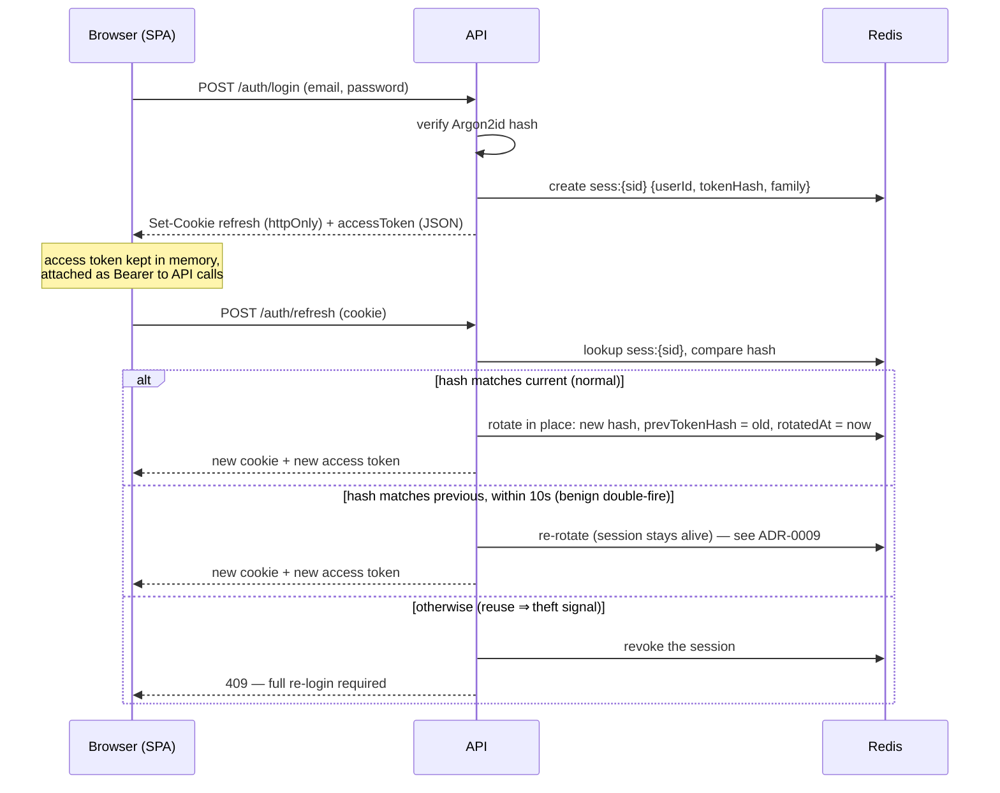

# 05 — Security

_Last updated: 2026-07-11 · Status: Accepted_

Scope: a public site with accounts, minimal PII (email + display name + reading activity), one admin. Design follows OWASP guidance current in 2026 (ASVS-informed, JWT BCP RFC 8725, OAuth Security BCP RFC 9700 where applicable).

## Authentication design ([ADR-0005](adr/0005-jwt-refresh-rotation.md))

The 2026-standard SPA pattern: **short-lived access JWT in memory + opaque rotating refresh token in an httpOnly cookie + server-side session records in Redis with reuse detection.**

| Token | Form | Lifetime | Lives | Notes |
|---|---|---|---|---|
| Access | JWT, HS256 via `jose` | 15 min | JS memory only (never storage) | Claims: `sub`, `role`, `sid`, `iss`, `aud`, `exp`, `iat`; `iss`/`aud` verified. `iss` = `PUBLIC_BASE_URL`, `aud` = `bestbooks-api`. |
| Refresh | 256-bit random, opaque | 30 d absolute, rotated on every use | httpOnly cookie `bb_refresh`: `Secure; SameSite=Strict; Path=/api/v1/auth` | Cookie value is `{sessionId}.{secret}`; only the secret's SHA-256 is stored. `__Host-` is impossible here — it forbids a `Path` other than `/`. `jose` (not `@fastify/jwt`) keeps signing in `infra/` off Fastify (ADR-0003). |

There is **one `sess:{sid}` record per login**, with a stable `sid`; the secret is rotated in place. "The family" is that record — reuse revokes it (`DEL sess:{sid}` + drop from `sessidx`). A missing/expired session on refresh is a **401**; **409** is reserved for detected reuse specifically.

Decisions and rationale:
- **HS256, not RS256/EdDSA**: one service signs and verifies; asymmetric keys buy nothing until a second verifier exists. Secret is 256-bit, Ansible-Vault-managed, rotatable (dual-secret verify window: `JWT_SECRET` signs, `JWT_SECRET_PREVIOUS` still verifies).
- **Reuse detection with a grace window** ([ADR-0009](adr/0009-refresh-reuse-grace-window.md)): a refresh token presented twice is theft **or** a benign double-fire (boot refresh, StrictMode, racing tabs). Within a 10-second grace window a stale-by-one token is re-rotated (session kept); beyond it, reuse revokes the session. The web client also single-flights refresh.
- **Logout everywhere**: `sessidx:{userId}` lets password change / reset revoke all sessions.
- **Redis-down failure mode** (accepted): refresh and login fail closed; outstanding access tokens keep working ≤15 min. Monit restarts Redis well inside that window.
- **CSRF**: refresh cookie is `SameSite=Strict` + `Path`-scoped, and state-changing routes require the Bearer header (which a cross-site form can't set). The API additionally rejects cross-origin `Origin` headers. No CSRF token machinery needed.
- **Email flows**: verification (24h) and reset (1h) tokens are 256-bit random, stored **hashed** in Redis, single-use. Register/forgot endpoints return uniform responses (no account enumeration) and are rate-limited. A duplicate registration still returns 201-shaped and emails the real owner ("you already have an account") rather than the registrant. Login returns a uniform 401 for unknown-email vs wrong-password, and runs a dummy Argon2id verify on an unknown email so response timing doesn't leak account existence.

## Passwords

Argon2id via `@node-rs/argon2` (napi-rs — reliable arm64 prebuilds for the Graviton release build; behind the `PasswordHasher` port, so swappable) with OWASP-recommended params (m=19 MiB, t=2, p=1 — revisit annually). Policy: length 10–128, checked against a top-10k breached list; no composition rules, no forced rotation (NIST-aligned).

Rate limits are Redis-backed with a hand-rolled fixed-window limiter (atomic INCR + first-hit EXPIRE via a Lua script), keyed per docs/04 (`rl:{scope}:{key}`; login by IP + a hash of the email, so no PII in keys). A successful login clears the failure counter. (Escalating per-attempt backoff beyond the fixed window is a documented future refinement; the fixed window already delivers the observable 429 + `Retry-After`.)

## Authorization

Two roles enforced in the use-case layer (not just routes): `member` vs `admin`. Ownership checks (`my review`, `my shelf`) are part of the repository query (`WHERE user_id = $1`), so a missing check fails to "not found", never to another user's row. Verified email (`MV`) gates rating/review/report writes.

## Input & output safety

- Every request validated by TypeBox schema (types, ranges, lengths, `additionalProperties: false`).
- Responses serialised strictly from response schemas — unlisted fields (hashes, emails on public payloads) cannot leak.
- Review text is stored raw, rendered as text by React (no `dangerouslySetInnerHTML` anywhere; CSP as backstop). No user HTML/Markdown in MVP.
- Slugs generated server-side, `[a-z0-9-]` only.
- Open Library fetches: pinned to `openlibrary.org`/`covers.openlibrary.org` hosts, https only, 10s timeout, response size cap (5 MB covers), content-type checked, admin-triggered only — SSRF surface is a fixed allowlist.

## HTTP headers (`@fastify/helmet` + Nginx)

`Strict-Transport-Security: max-age=63072000; includeSubDomains` (preload after a settling period) · `X-Content-Type-Options: nosniff` · `Referrer-Policy: strict-origin-when-cross-origin` · `Permissions-Policy` minimal · `frame-ancestors 'none'`.

CSP (SPA has no third-party scripts): `default-src 'self'; img-src 'self' data:; style-src 'self' 'unsafe-inline'; script-src 'self'; connect-src 'self'; frame-ancestors 'none'; base-uri 'none'; form-action 'self'`. (`style-src 'unsafe-inline'` pending Tailwind-compatible tightening; tracked in backlog.)

## Platform & pipeline security

- **No long-lived AWS credentials anywhere**: GitHub Actions assumes an IAM role via **OIDC** (`id-token: write`), scoped to this repo + environment; the EC2 instance uses an instance role (S3 backup/media/release access + `ses:SendEmail`); IMDSv2 enforced. The single exception: one SMTP-only IAM user for Monit alerts ([06 — Infrastructure](06-infrastructure.md)).
- **Host**: SSH keys only (no passwords, no root login), SG restricts 22 to admin IP, unattended-upgrades on, fail2ban on sshd, ufw mirroring the SG, separate `bestbooks` service user, systemd unit hardening (`NoNewPrivileges`, `ProtectSystem=strict`, `PrivateTmp`, writable paths whitelisted).
- **Supply chain**: Dependabot (npm, actions, terraform), `npm audit` in CI (fail on high), CodeQL (free on public repos), third-party GitHub Actions pinned to commit SHAs, `package-lock.json` committed and installs via `npm ci` only (lockfile-exact).
- **Secrets**: Ansible Vault (vault passphrase in GH Actions secret + local password manager) for host/app secrets; GitHub environment secrets for CI. `.env` files never committed; `gitleaks` pre-commit hook.
- **Transport/at rest**: TLS 1.2+ (Let's Encrypt, auto-renew), EBS + S3 encryption on, S3 buckets block all public access.

## OWASP Top 10 (2021/2025) quick map

| Risk | Main control here |
|---|---|
| Broken access control | Use-case-layer role checks; ownership in queries; verified-email gate |
| Cryptographic failures | Argon2id; hashed tokens at rest; TLS everywhere; no homemade crypto |
| Injection | Drizzle parameterised queries; TypeBox validation; React auto-escaping + CSP |
| Insecure design | This doc suite + ADRs; walking-skeleton pipeline before features |
| Security misconfiguration | Ansible = config as reviewed code; helmet defaults; SG/ufw minimal |
| Vulnerable components | Dependabot + audit gate + CodeQL; LTS-only runtimes |
| Auth failures | §Authentication above (rotation, reuse detection, rate limits, backoff) |
| Data integrity failures | Pinned actions (SHA), lockfile, signed AWS OIDC federation |
| Logging/monitoring failures | Pino + journald with request IDs; Monit alerting; auth events logged (no secrets/PII) |
| SSRF | OL host allowlist (only outbound fetch in the system) |

## Explicitly deferred (backlog)

BFF/token-handler pattern (RFC 9700's strongest SPA posture — overkill at this scale, revisit if auth surface grows) · 2FA/TOTP · CSP nonce tightening · WAF/CloudFront · account self-deletion & export UI (schema already cascades) · SIEM-grade audit trail (admin actions get structured logs from day one).
