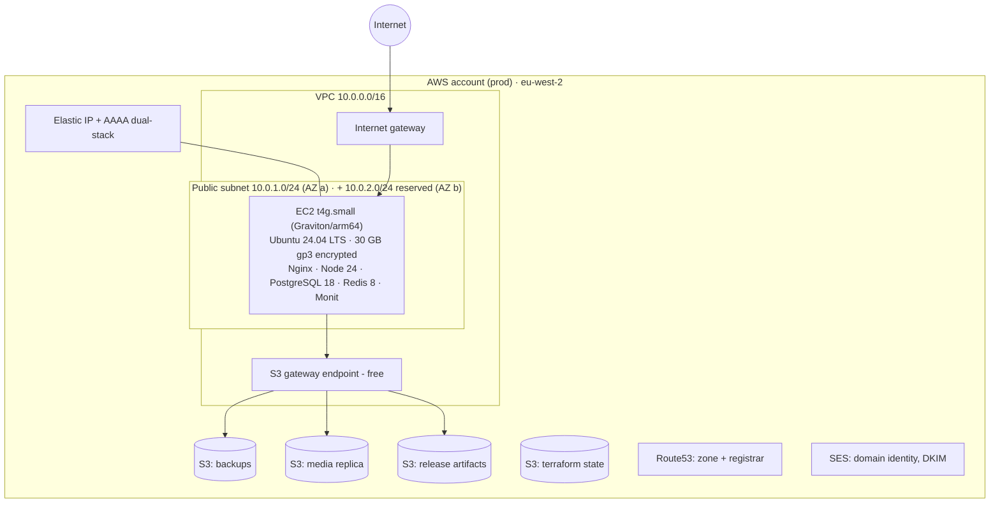

# 06 — Infrastructure (AWS)

_Last updated: 2026-07-12 · Status: Accepted_

One production environment, one EC2 host, managed AWS services around it. Everything below is Terraform-managed except the one-time bootstrap (state bucket + OIDC) and the domain purchase.

**Region: `eu-west-2` (London) — confirmed** (2026-07-11); still a single Terraform variable if it ever changes. **Domain: `bestbooks.guide` — registered in Route53** (2026-07-12).

## Topology

## VPC & network

- VPC `10.0.0.0/16`, DNS support on. Two public subnets across AZs (`a` in use, `b` reserved — an ALB later needs two; costs nothing to reserve now).
- Internet gateway; public route table. **No NAT gateway** (~$35/mo) — nothing private needs egress yet. When a private tier appears, add NAT then.
- **S3 gateway endpoint** (free): backup/media/release traffic to S3 stays off the public path.
- IPv6: dual-stack enabled; AAAA published. (IPv4 is unavoidable for reach and costs $3.65/mo since AWS started charging for public v4.)

Security group `web`:
| Port | Source | Purpose |
|---|---|---|
| 443, 80 | 0.0.0.0/0, ::/0 | HTTPS + ACME/redirect |

**No SSH ingress.** Both the admin and CI reach the host by tunnelling SSH over
**SSM Session Manager**, authorised by IAM rather than by source IP. An IP allowlist
was never workable — GitHub's runners have dynamic addresses, and the admin's own IP
rotates (it locked us out once). The instance role carries `AmazonSSMManagedInstanceCore`;
the agent ships with the Ubuntu AMI. Ansible targets the **instance ID** via a
ProxyCommand (see the inventory). Break-glass with no ingress at all:
`aws ssm start-session --target <instance-id>`.

The SG uses `name_prefix` + `create_before_destroy`: a security group's `description`
is immutable, so editing it replaces the whole SG — and an in-place replace deadlocks
(AWS won't delete an SG that's still attached, while its rules are already gone). This
took the site down once; don't remove that lifecycle block.

Egress: open (OL imports, apt, Let's Encrypt, SES).

## EC2 host

- **t4g.small** (2 vCPU Graviton, 2 GB) — right-sized for launch traffic with PG tuned modestly; resize path: stop → change type → start (minutes of downtime, acceptable). `t4g.medium` (4 GB) is the first upgrade if memory pressure shows in Monit.
- arm64 matters downstream: CI builds release artifacts on GitHub's free arm64 runners so native modules (argon2) match ([07 — Operations](07-operations.md)).
- Ubuntu 24.04 LTS AMI (Canonical official, arm64). 26.04 LTS exists (Apr 2026) — adopt at 26.04.1 via rebuild, not in-place ([TODO](../TODO.md)).
- 30 GB gp3 root volume, encrypted, `delete_on_termination = false`.
- IMDSv2 required. Instance profile grants: rw on backups + media buckets, read on releases bucket, `ses:SendEmail` scoped to the verified identity. Nothing else.
- Termination protection on; all Terraform, no console-clicking.

**The host is cattle, not a pet, despite being singular**: `terraform apply` + `ansible-playbook site.yml` + restore-from-S3 must rebuild it from zero — that's the DR story and it gets tested (M5).

## S3 buckets

| Bucket | Contents | Controls |
|---|---|---|
| `bestbooks-prod-backups` | Nightly `pg_dump` (zstd) + Redis RDB copy | SSE-S3, versioning off, lifecycle: dailies expire 30d; weeklies (separate prefix) kept 90d; block public |
| `bestbooks-prod-media` | Replica of `/srv/bestbooks/media` (covers) | Nightly sync; restore source on rebuild; block public |
| `bestbooks-prod-releases` | `release-<git sha>.tar.gz` from CI | Lifecycle 60d; block public |
| `bestbooks-terraform-state` | TF state (bootstrap-managed) | Versioning **on**, SSE, `use_lockfile` native locking — no DynamoDB table (current practice since TF 1.11) |

Covers are **served from local disk by Nginx** (simplest correct thing on one host, immutable cache headers); S3 is replica/restore. Moving to S3+CloudFront origin is a config change later, not a schema change.

## Route53 & TLS

- Domain **`bestbooks.guide`** registered directly through **Route53 Registrar** (2026-07-12) — registration and the public hosted zone sit in the same account, so nameserver delegation is automatic and there's one AWS bill. A `.guide` TLD renews at ~$25–35/yr (above the earlier ~$14 `.com` estimate — reflected in [§Cost](#cost-approx-eu-west-2-july-2026-pricing)).
- Public hosted zone: `A`/`AAAA` apex → EIP, `www` → apex redirect (Nginx), `CAA 0 issue "letsencrypt.org"`, SES records below.
- TLS via **Let's Encrypt** (certbot, http-01 through Nginx), auto-renewed by systemd timer, expiry watched by Monit. ACM certs are ALB/CloudFront-only — not usable on a bare EC2, hence LE.

## SES (eu-west-2)

- Domain identity + **Easy DKIM** (2048-bit, 3 CNAMEs via Terraform), custom MAIL FROM `mail.bestbooks.guide` (SPF), DMARC `p=none` → `p=quarantine` after a clean month.
- **Sandbox exit** (production access request, ~24h turnaround) needed before emailing arbitrary addresses — do it during M2 while testing against own inboxes ([TODO](../TODO.md)).
- App sends via SDK v3 + instance role (no SMTP creds). Monit alerts via SES **SMTP** (single-purpose IAM user, `ses:SendRawEmail` only — the one static credential in the system, Vault-stored).
- Configuration set with CloudWatch-free event handling deferred; MVP relies on SES feedback forwarding for bounces (volume: transactional only).

## Backups & disaster recovery

| What | How | When | Restore |
|---|---|---|---|
| PostgreSQL | `pg_dump -Fc \| zstd` → backups bucket | Nightly 03:00 UTC (systemd timer) + pre-migration dump in deploy | `pg_restore` runbook in [07](07-operations.md) |
| Media (covers) | `aws s3 sync` → media bucket | Nightly | sync back on rebuild |
| Redis | RDB snapshot copy → backups bucket | Nightly | optional restore; losing it = everyone re-logs-in |
| Host config | none — it's all Ansible | — | re-run `site.yml` |

- **RPO 24 h, RTO ~2 h** (fresh `terraform apply` + `site.yml` + restore + DNS already pointing at new EIP). Documented, and rehearsed in M5.
- Backup restore is **tested quarterly** (calendar reminder in TODO) — an untested backup is a rumour.
- Timer scripts emit a success heartbeat file checked by Monit (silent-failure guard).

## Cost (approx, eu-west-2, July 2026 pricing)

| Item | $/month |
|---|---|
| EC2 t4g.small on-demand | ~13 |
| Public IPv4 (EIP attached) | 3.65 |
| EBS 30 GB gp3 | ~2.90 |
| S3 (≈10 GB + requests) | ~0.50 |
| Route53 zone + queries | ~0.60 |
| SES (transactional volumes) | ~0 |
| Data transfer out (first 100 GB free) | ~0 |
| **Total** | **≈ $21/mo** + `bestbooks.guide` ~$25–35/yr |

Savings later: 1-yr Compute Savings Plan (~30% off EC2) once the instance type has settled. AWS Budgets alarm at $30 configured in bootstrap ([TODO](../TODO.md)).

## Well-Architected alignment (right-sized for a single-host MVP)

| Pillar | How addressed |
|---|---|
| Operational excellence | Everything as code (TF/Ansible), CI/CD, runbooks, Monit alerts |
| Security | OIDC-only CI creds, instance roles, IMDSv2, SG minimal, encrypted storage — [05](05-security.md) |
| Reliability | Single host is the accepted trade-off; mitigations: Monit auto-restart, tested backups, 2h rebuild path |
| Performance | Graviton price/perf, gp3, Redis cache path ready; measure before scaling |
| Cost | ~$21/mo, no idle managed services, S3 lifecycles, budget alarm |
| Sustainability | Graviton arm64, single small always-on host |

## Scaling path (each step is additive, none is a rewrite)

1. **Vertical**: t4g.small → medium/large (minutes).
2. **Split data tier**: move PG (+ Redis) to a second instance — Ansible roles already separate; or adopt RDS/ElastiCache at the same step ([ADR-0007](adr/0007-self-managed-data-stores.md) records the revisit triggers).
3. **Horizontal web tier**: ALB + second app host (subnet `b` reserved; sessions already in Redis, media moves to S3 origin — both anticipated).
4. **CDN/SEO**: CloudFront in front; SSR per [ADR-0008](adr/0008-spa-first-ssr-ready.md).
